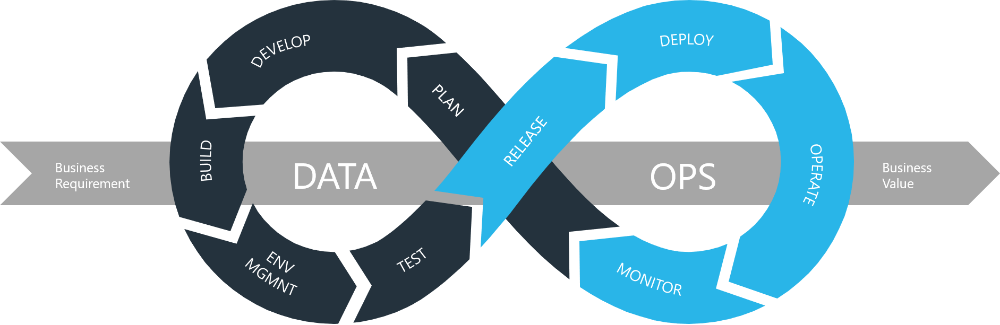

# DataOps-Roadmap

 

## Fundamental Step

## Step 0: Basic requirements
- Linux (LPIC-1)
    - [LPIC-1 with Jadi](https://maktabkhooneh.org/course/%D8%A2%D9%85%D9%88%D8%B2%D8%B4-%D8%B1%D8%A7%DB%8C%DA%AF%D8%A7%D9%86-%D8%A2%D8%B2%D9%85%D9%88%D9%86-LPIC1-mk711/) (Persian Language)
    - [LPIC-1 CBTnuggets](https://www.cbtnuggets.com/it-training/linux/lpic-1-linux-administrator) (English Language)
- Bash-Script
    - [Bash Script Tutorial](https://github.com/ahmadalibagheri/bash-script-tutorial) (Sample Traning Code)
- Git
    - [Git Learning with Jadi](https://faradars.org/courses/fvgit9609-git-github-gitlab) (Persian Language) 
    - [Git Learning with Mosh](https://codewithmosh.com/p/the-ultimate-git-course) (English Language) 
    - 
 💡 *By the end of this chapter, we will be capable of write some bash scripts and use Linux to automate some tasks and also we will be able to collaborate on github using Git.*
 
## Step 1: 

## Step 2: 

## Step 3: Continuous Integration/Continuous Deployment

## Step 3.1: Python (optional)

## Step 4: Monitoring
